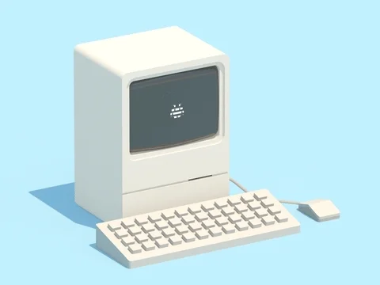

# Welcome 🙋🏻‍♂️  I am Millennial Dev!

### Introduction &nbsp;🚀

Thank you for coming to my profile. I am a Multi-talented Software Engineer 👨🏻‍💻&nbsp;&nbsp;🌐 with over 5+ years of experience in wide range of engineering disciplines 🤖&nbsp;⚙️. I am Passionate about innovative design 🎨, and while working in the robotics &amp; automation industry, I found a love for writing software.
 
 
I enjoy exploring the outdoors in my free time when I am not coding 🏕 🏔 🏞
 
 

Nothing beats coding to lofi beats in my opinion 🎧&nbsp;💽, with some herbal tea or coffee ☕️.
If you feel so inclined, you can buy me a coffee <a href="https://www.buymeacoffee.com/millennialdev" target="_blank">here</a>, to support my work ☺️.

 

### 🧐 More About Me:

- 🔭 &nbsp; I’m currently working on <a href="https://upgather.com/" target="_blank">Upgather</a>
- 💼 &nbsp; Employed at <a href="https://scoopnewsgroup.com/" target="_blank">Scoop News Group</a>
- 🤝 &nbsp; Looking to collaborate on <b>cool open source projects</b>
- 💡 &nbsp; Currently learning a lot about 3D libraries &amp; Vim
- 🔬 &nbsp; Many of my projects are available on <a href="https://github.com/millennialdev?tab=repositories" target="_blank">Github</a>
- 🎓 &nbsp; I studied Mechanical Engineering during university
- 💬 &nbsp; Ask me about anything software/tech related!
- 📫 &nbsp; Feel free to ping me on <a href="https://www.linkedin.com/in/spenserwellen/" target="_blank">Linkedin</a>

 

### 🛠 Languages and Tools:

 
 
 
 
 

### 📊 Github Stats

 

 

 

<!--
### 🛠️ My Projects

 -->
