

  

  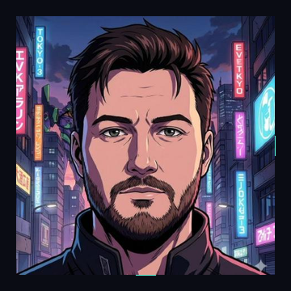
   
  
   
  
  
  
  

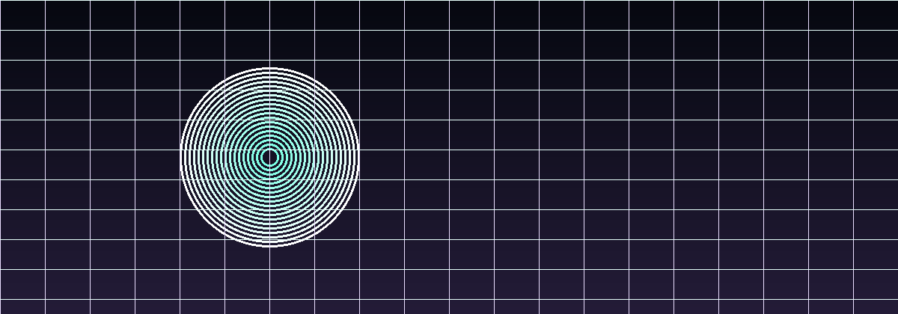

## AI + Scale Impact

I build AI-powered products that ship fast, scale confidently, and feel crisp to end users. My focus is end-to-end: product, data pipelines, model integration, and production reliability.

  
  
  
  

  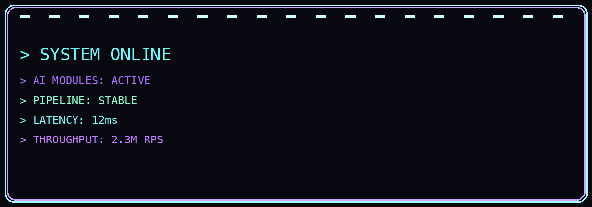

## Tech Arsenal

  
   
  

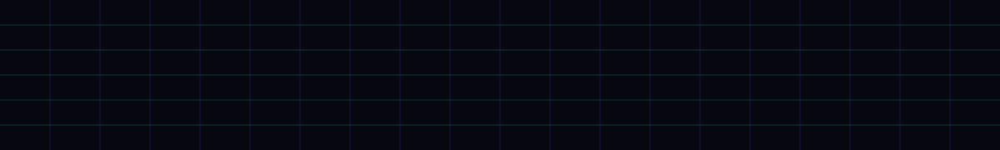

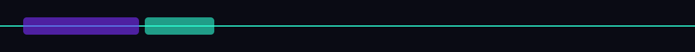

## Featured Projects

<table>
  <tr>
    <td width="50%" valign="top">
      <h3>ADONIC — AI Facial Analysis</h3>
      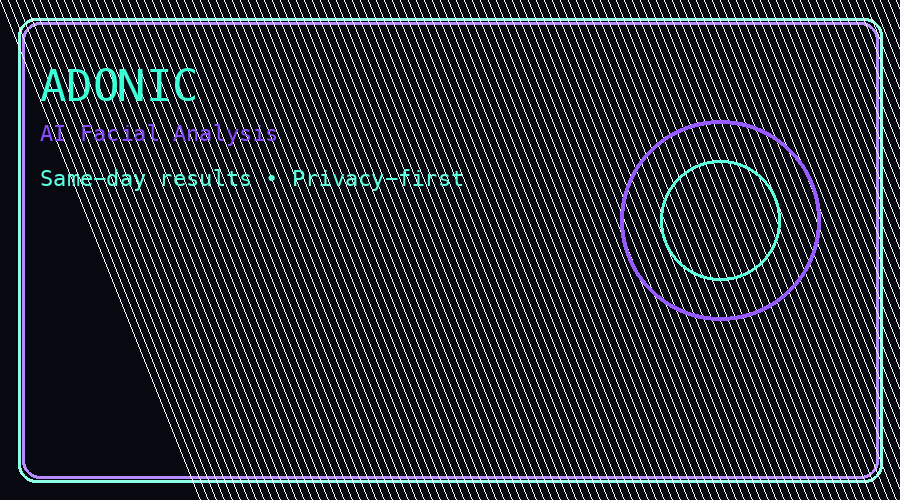
      
AI-powered deep facial analysis with same-day results, built around privacy-first data handling and a frictionless one-time purchase.

      
<strong>Highlights:</strong> 10-category analysis, PDF report delivery, 120-day secure retention with auto deletion.

      
    </td>
    <td width="50%" valign="top">
      <h3>VADO — AI PropTech Platform</h3>
      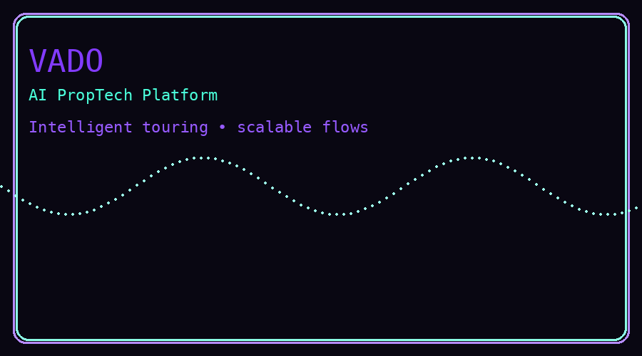
      
AI-powered home touring platform that modernizes property exploration with intelligent routing, automation, and scalable user flows.

      
<strong>Tech:</strong> Astro, Next.js, React Native, OpenAI, Twilio.

      
    </td>
  </tr>
</table>

## AI Systems Blueprint

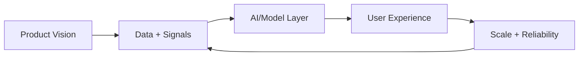

## Timeline Highlights

- Built AI features across startups and enterprise platforms serving millions of users.
- Led full-stack architecture with cloud-first delivery and performance tuning.
- Shipped privacy-first AI products with rapid iteration cycles.
- Bridged product, engineering, and go-to-market to ship polished systems.

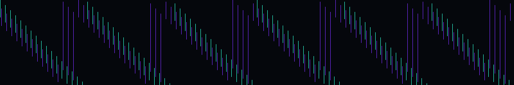

## Open Source + Activity

  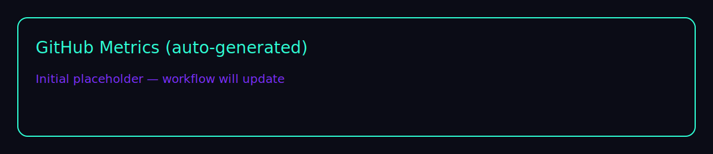

  
  

  

  

  

  

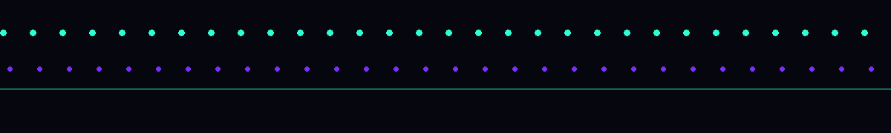

## Creativity + Hobbies

  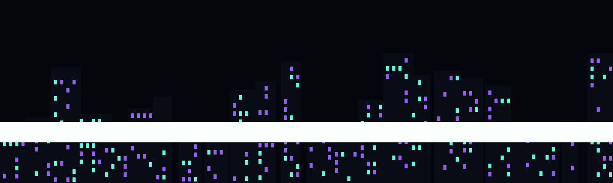

- Hiking ridgelines, modding cars, nature photography, and curating DJ sets.
- Experimenting with generative visuals, motion design, and cyberpunk-inspired UI systems.

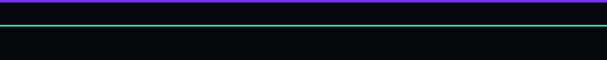

## Connect

  
  
  

